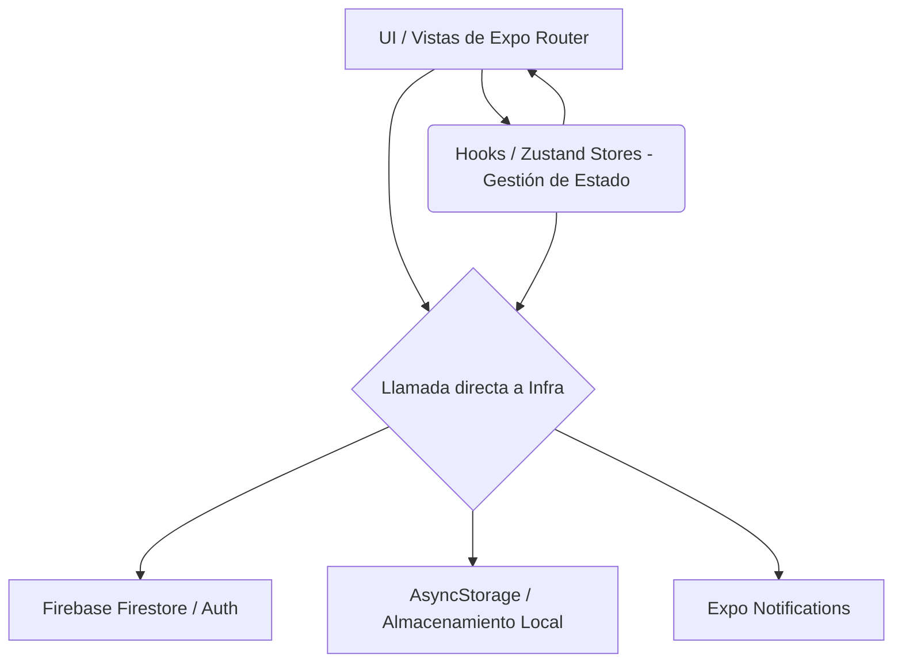

# Arquitectura del Sistema (ARCHITECTURE MAP)

Este documento describe el modelo arquitectónico actual de **FormulaPanadera**, basado exclusivamente en el análisis estático del código fuente (React Native + Expo). Su objetivo es servir como mapa mental técnico para entender la interacción entre componentes sin necesidad de leer todo el código.

## Visión General

El sistema implementa una **Arquitectura Basada en Componentes (Component-Based Architecture)** con un fuerte patrón **MVVM (Model-View-ViewModel)** adaptado al ecosistema de React. A diferencia de un backend clásico con Arquitectura Hexagonal o por Capas estrictas, aquí la orquestación y el estado residen en el cliente (Client-Side Monolith) apoyado en un modelo *Serverless* (Firebase) para la persistencia y autenticación en la nube.

## Diagrama de Flujo Lógico

Flujo típico de una petición o evento del usuario (ej. Cargar recetas o guardar temporizador):

*Nota: Actualmente el sistema permite que las vistas (Pantallas en `/app`) hagan llamadas directas a la capa de infraestructura (Firebase/AsyncStorage) sin pasar siempre por una capa intermedia de "Servicio" abstracta.*

## Capas del Sistema

### 1. Capa de Presentación (Views / Routing)
*   **Tecnología:** React Native, Expo Router.
*   **Responsabilidad:** Renderizar la interfaz de usuario, capturar eventos de interacción y manejar la navegación basada en el sistema de archivos (`/app`).
*   **Punto de Entrada:** `app/_layout.tsx` actúa como el "Application Context" o Gateway inicial, donde se inyectan los proveedores de temas, se verifica el estado de sesión (Auth Observer) y se inicializan configuraciones nativas (Notificaciones).

### 2. Capa de Aplicación y Gestión de Estado (ViewModels / Orchestration)
*   **Tecnología:** Zustand (`/store`), React Hooks (`/hooks`).
*   **Responsabilidad:** Mantener el estado global de la aplicación (In-Memory State) y encapsular lógica de UI compartida.
*   **Componentes Clave:** 
    *   `authStore.ts`: Gestiona el ciclo de vida del usuario (`user`, `loading`, `isGuest`). Análogo a un `SecurityContextHolder`.
    *   `timerStore.ts`: Mantiene el estado efímero de las etapas de levado y datos de cocción activos. Actúa como una fachada de estado para que múltiples pantallas interactúen con el mismo temporizador.

### 3. Capa de Dominio (Core)
*   **Tecnología:** TypeScript Types / Constantes estáticas.
*   **Responsabilidad:** Definir las estructuras de datos puras (Tipos: `Receta`, `Ingrediente`, `Coccion`) y los datos semilla del sistema.
*   **Componentes Clave:** `/constants/recetas.ts`. Aquí reside el conjunto de datos inmutables (Seed Data) y las definiciones de los *Records* de negocio. No tiene dependencias externas.

### 4. Capa de Infraestructura / Adaptadores
*   **Tecnología:** Firebase SDK (Auth, Firestore), Expo SDK (Notifications), AsyncStorage.
*   **Responsabilidad:** Proveer acceso a datos persistentes (nube y local) e integraciones con hardware del dispositivo.
*   **Integración:**
    *   `/config/firebase.ts`: Inicializa y exporta los singletons de los clientes de Auth y Firestore (análogo a beans de configuración o `@Configuration`).
    *   Persistencia Híbrida: Se observa el uso de Firestore (vía llamadas directas a `collection`, `getDocs`) para usuarios logueados, y de `AsyncStorage` como fallback offline/invitado.

## Decisiones de Diseño Detectadas

1.  **Inversión de Control Parcial (Stores como Singletons):** Zustand se utiliza para proveer un acceso centralizado al estado sin usar *prop-drilling* (Inyección de dependencias a nivel de propiedades), actuando funcionalmente como beans Singletons inyectables vía Hooks.
2.  **Acoplamiento UI-Infraestructura:** En la implementación actual, los "Controllers" (las pantallas en `app/`) realizan llamadas directas al SDK de Firebase y a AsyncStorage (ej: en `app/(tabs)/index.tsx`). **No existe una capa estricta de repositorios** abstractos (Ej. `IRecipeRepository`) que aísle a la UI de la tecnología de base de datos.
3.  **Manejo Híbrido de Sesión (Guest vs Cloud):** El sistema implementa lógicas condicionales explícitas (IFs de negocio) en las vistas basándose en el estado `isGuest` para determinar si lee/escribe en el almacenamiento local o en Firestore.
4.  **Observer Pattern en Auth:** Se utiliza `onAuthStateChanged` en la raíz de la aplicación para actualizar reactivamente el estado de autenticación global en Zustand, desencadenando redirecciones automáticas en el router.

## Comunicación Inter-modular

*   **Sincrónica (Componentes):** Paso de parámetros por *Props* o parámetros de ruta (URL params en Expo Router).
*   **Asincrónica (Estado y Eventos):** Uso de Zustand para notificar cambios de estado a todos los componentes suscritos reactivamente, similar a un sistema de publicación/suscripción local.
*   **Procesos de Segundo Plano:** Se configuran Handlers explícitos (`Notifications.setNotificationHandler`) para interceptar y procesar notificaciones locales en un hilo separado o cuando la aplicación está en segundo plano.
